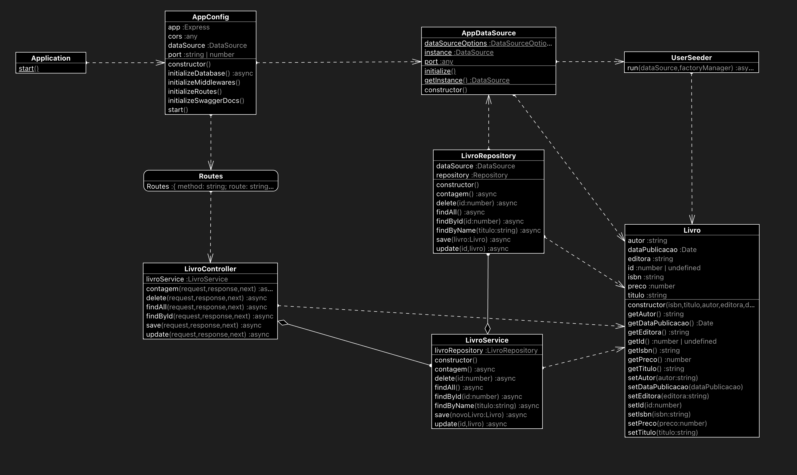

# Executando a aplicação

## Requisitos
 * Docker
 * Postman

## Build da aplicação

Antes de realizar o build da aplicação basta criar um arquivo **.env** na raiz do projeto e copiar o conteúdo do arquivo **.env.example**.

Após isso basta executar o comando:

```sh
docker-compose up -d
```

Este comando irá realizar o build da aplicação, irá subir o banco de dados PostgreSQL e também o PG Admin via container Docker.

A aplicação em si irá povoar o banco de dados automaticamente via Seeds.

## Acessando a aplicação

localhost:8080

## Acessando documentação de API Swagger

Acessar no navegador localhost:8080/api-docs

As requisições também podem ser testadas nesta página.

## Uso da collection Postman

Collection postman disponível em [LivroAPI.postman_collection.json](./docs/LivroAPI.postman_collection.json)

Basta importar no Postman e testar as requisições.

## Diagrama C4 Model

### Nivel 1 - Contexto

TO-DO

### Nivel 2 - Container

TO-DO

### Nivel 3 - Componente

TO-DO

### Nivel 4 - Codigo

